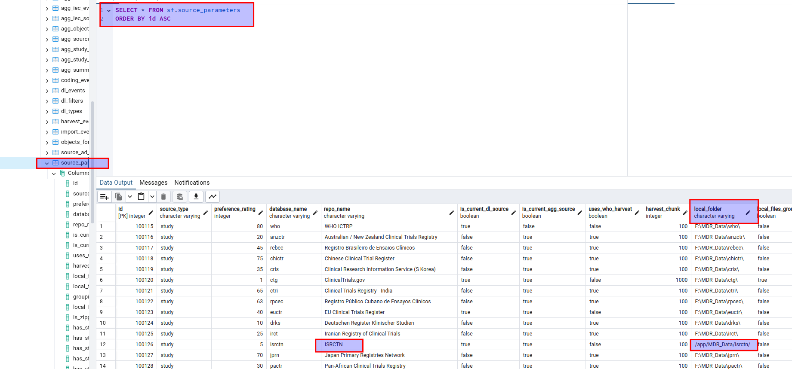

After running:

```
michelescarlato@krang:~/gitrepo/mdr_on_linux_server/dockerfiles/MDR_Downloader$ docker-compose up --remove-orphans who
```


these three directories have been created:

```
michelescarlato@krang:~$ ls -lah $HOME/MDR_Data/
total 312K
drwxrwxr-x  6 michelescarlato michelescarlato 4,0K set 29 15:03 .
drwxr-x--- 51 michelescarlato michelescarlato 4,0K set 27 14:52 ..
drwxr-xr-x  2 root            root             16K set 29 15:03 anzctr
drwxr-xr-x  2 root            root             20K set 29 15:03 chictr
drwxr-xr-x  2 root            root            260K set 29 15:03 nntr
drwxrwxr-x  2 michelescarlato michelescarlato 4,0K set 23 14:44 test
```

```
michelescarlato@krang:~/gitrepo/mdr_on_linux_server/dockerfiles/MDR_Downloader$ docker-compose up --remove-orphans isrctn
```

No directories have been added to MDR_Data.
Investigating why at the moment ..

Local_folder is taken from mon db.


I just updated the directory for ISRCTN



It seems that this is not the only point where the local_folder variable is taken.
On `appsettings.json` this line should be added:
```
{
    ...
    "dataFolderPath": "/app/MDR_Data/",
    ...
}
```
It is loaded at this step:

```
public class LoggingHelper : ILoggingHelper
{
    private readonly string _dataFolderPath;
    private readonly string _logfileStartOfPath;
    private readonly string _testFilePath;    
    private readonly string _summaryLogfileStartOfPath;
    private string _logfilePath = "";
    //private string _summaryLogfilePath = "";
    private string summary_string = "";
    private StreamWriter? _sw;

    public LoggingHelper(IConfiguration settings)
    {
        _logfileStartOfPath = settings["logFilePath"] ?? "";
        _summaryLogfileStartOfPath = settings["summaryFilePath"] ?? "";
        _testFilePath = settings["testFilePath"] ?? "";
        _dataFolderPath = settings["dataFolderPath"] ?? "";
    }
```
URL Ref:
https://github.com/scanhamman/MDR_Downloader/blob/master/MonitorHelpers/LoggingHelper.cs#L30
